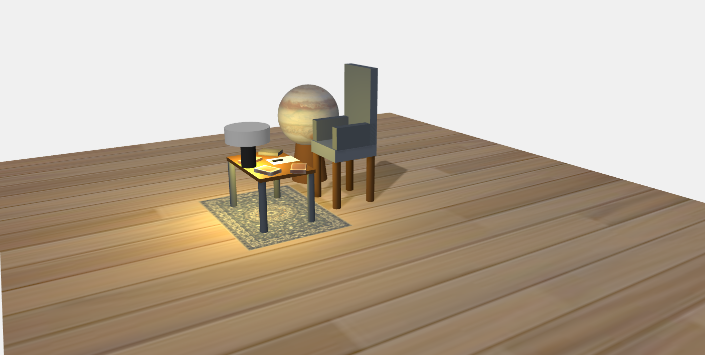
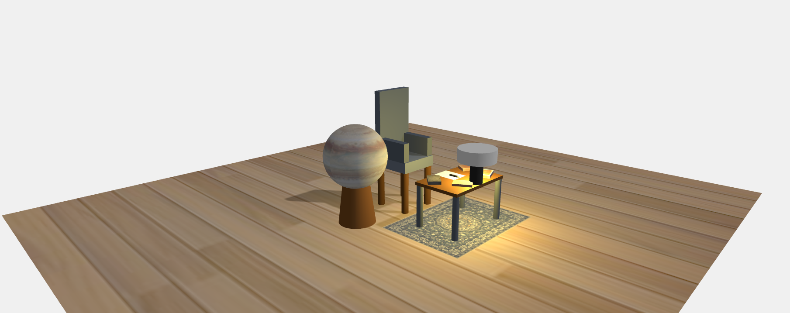

# Graphics_Individual_assignment_Yonas-Tessema-Achule-ATR-9419-14
by
<br>
Name: Yonas Tessema Achule 
<br>
ID: ATR/0419/14
<br>
Section: 3


# Reading Space 3D Viewer

## Project Overview
This project is an **interactive 3D viewer application** developed as part of a school assignment. It showcases a virtual reading space, complete with furniture and decorative elements, using **Three.js**. The application allows users to explore the scene interactively, with features such as camera controls, object highlighting, and animations.

### Key Features
- **Interactive Camera Controls**: Users can rotate, zoom, and pan the camera to explore the scene.
- **Realistic Lighting**: Ambient and directional lighting simulate natural illumination and shadows.
- **Detailed 3D Models**: Includes a sofa, table, lamp, rug, plant, books, and other objects created using basic geometries.
- **Mouse Interaction**: Hover and click effects provide feedback, including object highlighting and scaling.
- **Animation**: Smooth camera auto-rotation and subtle pulsing effects bring the scene to life.

---

## Technologies Used
- **Three.js**: A JavaScript library for creating 3D graphics in the browser.
- **HTML5 Canvas**: Used for rendering the 3D scene.
- **CSS**: Styling for the overlay panel and canvas.
- **Vite**: A fast development server for modern web applications.

---

## Project Structure
The project is organized into modular files for better maintainability:

### **Source Files**
- **`main.js`**: Entry point for the application. Initializes the scene, adds objects, and starts the animation loop.
- **`scripts/initScene.js`**: Sets up the Three.js scene, camera, renderer, and OrbitControls.
- **`scripts/addLighting.js`**: Adds ambient and directional lighting to the scene.
- **`scripts/createEnvironment.js`**: Creates the floor and other environmental elements.
- **`scripts/createProduct.js`**: Contains functions to create 3D models such as the sofa, table, lamp, rug, plant, and books.
- **`scripts/interaction.js`**: Handles mouse interactions, including hover and click effects.
- **`scripts/cameraAnimation.js`**: Manages camera auto-rotation and animations.

### **Assets**
- **Textures**: Includes textures for the floor, books, and other objects.
- **CSS**: Styling for the canvas and overlay panel.

---

## Installation and Setup
Follow these steps to run the project locally:

### **Prerequisites**
- Node.js (v16 or higher)
- npm (Node Package Manager)

### **Steps**
1. Clone the repository:
   ```bash
   git clone https://github.com/yonas-t-a/Graphics_Individual_assignment_Yonas-Tessema-Achule-ATR-9419-14.git
   ```
2. Navigate to the project directory:
   ```bash
   cd Graphics_Individual_assignment_Yonas-Tessema-Achule-ATR-9419-14
   ```
3. Install dependencies:
   ```bash
   npm install
   ```
4. Start the development server:
   ```bash
   npm run dev
   ```
5. Open the application in your browser at vite provided url.

---

## How to Use
1. **Explore the Scene**: Use your mouse to rotate, zoom, and pan the camera.
2. **Interact with Objects**: Hover over objects to highlight them. Click on objects to see scaling effects and additional details.
3. **Enjoy the Animation**: Watch the camera auto-rotate smoothly around the scene.

---

## Screenshots
### **Screenshot 1**


### **Screenshot 2**


---

## Author
**Yonas Tessema Achule**  
- **ID**: ATR/0419/14  
- **Section**: 3  

This project was developed as part of an individual assignment for school.

---

## License
This project is licensed for educational purposes only. Redistribution or commercial use is prohibited.
